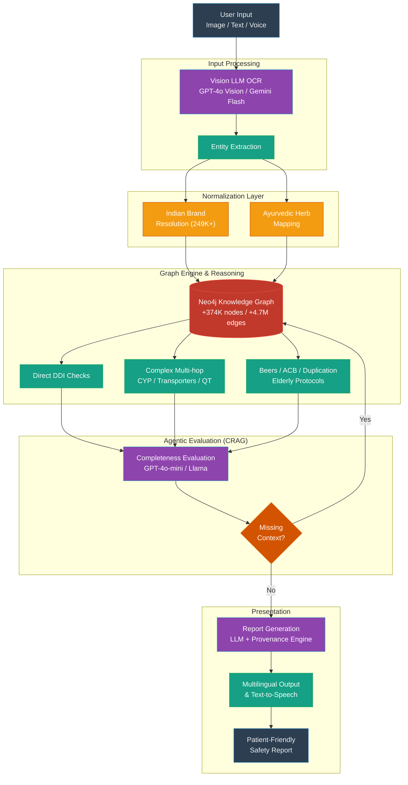
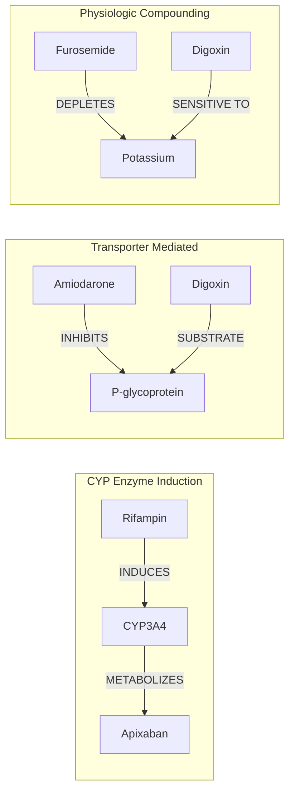

<h1 align="center">Sahayak - AI Medication Safety Assistant</h1>

<p align="center"><strong>A graph-first, AI-enhanced medication safety assistant built for Indian elderly patients.</strong></p>

<p align="center">
  Sahayak acts as an intelligent safety net against adverse drug reactions, drug-herb interactions, and multi-hop drug metabolization risks. It is specially trained on Indian brand names, Ayurvedic herbs, and elderly safety protocols.
</p>

<p align="center">
  <a href="https://drive.google.com/file/d/1flDrBc4azwtw6EeM76nGWD4jQp2GkK5x/view?usp=drivesdk">Watch 2-Min Demo</a>
  ·
  <a href="https://drive.google.com/file/d/1gquj4NYOrq74wG2DNj3Sqbq6spR4T5Ta/view?usp=drive_link">Download Android APK</a>
  ·
  <a href="./docs/SAHAYAK_COMPLETE_EXPLAINER.md">Full Technical Explainer</a>
</p>

---

## 🌟 What is Sahayak?

Most generic medication checkers fail in the real-world Indian context because they assume uniform naming conventions, ignore alternative medicines, and evaluate drug pairs in isolation.

Sahayak addresses these critical gaps end-to-end:
*   **Indian Brand Name Resolution**: Over 249K+ Indian brand names mapped directly to their generic counterparts.
*   **Ayurvedic Herb Integration**: Detects safety risks with common Ayurvedic supplements (e.g., Ashwagandha, Garlic) ignored by western systems.
*   **Multi-hop Risk Reasoning**: Flags unseen risks propagating through complex metabolic chains (CYP enzymes, Transporters, QT, CNS, and Electrolyte compounding).
*   **Advanced OCR Extractor**: Reads directly from prescription images or medicine strips using Vision LLMs, supporting Indic fonts.
*   **Patient-Friendly Reporting**: Translates dense pharmaceutical warnings into highly actionable, easy-to-understand alerts for patients and caregivers while maintaining rigid clinical provenance.

---

## 🧠 Agentic Flow Architecture

Sahayak operates via a sophisticated CRAG (Corrective Retrieval-Augmented Generation) pipeline that seamlessly orchestrates Visual OCR, graph reasoning, and secondary evaluation mechanisms.



### Multihop Reasoning Deep Dive

Sahayak identifies hidden interactions through **5 major cascading mechanisms**.



---

## 🛠 Tech Stack

Sahayak relies on a modern, decoupled stack across multiple layers:

| Component | Technologies Used |
| :--- | :--- |
| **Mobile App** | Expo 54, React Native 0.81, React 19, Expo Router, NativeWind |
| **Web Frontend** | Next.js 16.2, React 19.2, Tailwind CSS 4, Base UI |
| **Backend & APIs** | FastAPI, Pydantic 2, LangGraph, LangChain |
| **Knowledge System** | Neo4j 5 |
| **AI Models** | GPT-4o Vision, Gemini 2.0 Flash, Llama 3.2 90B Vision |
| **Data Sources** | DDInter, DDID, PrimeKG, SIDER, Indian Medicine DB, FDA NDC, Beers 2023 |

---

## 🚀 Running Sahayak Locally

### Prerequisites
- Docker & Docker Compose
- Node.js 18+ (for frontend/mobile dev)
- Access to Neo4j (local or cloud)

### Quick Start via Docker

1. Clone the repository and enter the directory.
   ```bash
   git clone https://github.com/PAMIDIROHIT/sahayak.git
   cd sahayak
   ```

2. Setup `.env` configuration file:
   ```bash
   cp .env.example .env
   # Fill in the required API keys (OpenAI / Groq) and set up the Neo4j password inside .env
   ```

3. Spin up the infrastructure using Docker Compose:
   ```bash
   docker compose up --build -d
   ```

4. Check the service health (should display the 374K+ nodes):
   ```bash
   curl http://localhost:8000/healthz
   ```

   **Expected Output:**
   ```json
   {"status": "ok", "service": "SAHAYAK", "neo4j": true, "graph_nodes": 374752}
   ```

> **Note:** The Neo4j Browser will be available at `http://localhost:7474`.

---

## 📖 Evaluation & Validation

To ensure Sahayak passes clinical scrutiny without hallucinating on safety risks, we subjected the architecture to rigorous evaluations:

- **100% Sensitivity** on 50 critical sentinel interaction benchmarks.
- **100% Path Precision** across multi-hop reasoning targets.
- **0% Hallucinations** discovered natively in grounded evaluation reports.
- Deep provenance-tracking capabilities validating citation origins.

*(Full empirical statistics and validations are available in our [Full Technical Explainer](./docs/SAHAYAK_COMPLETE_EXPLAINER.md))*

## 📜 License

[MIT License](./LICENSE)
